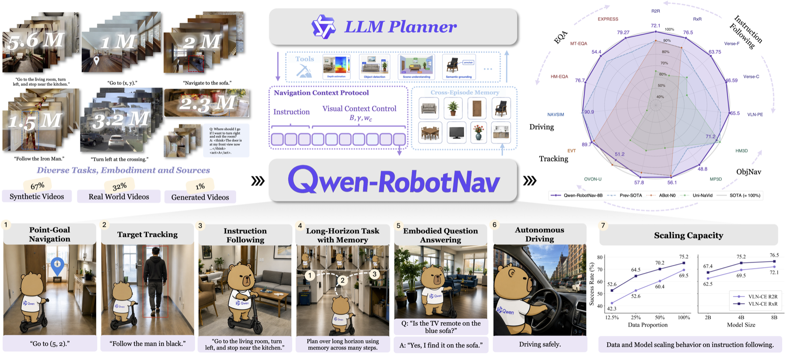

<div align="center">


<h1 style="border: none;">Qwen-RobotNav</h1>

<p><b>A Scalable Navigation Model Designed for an Agentic Navigation System</b></p>

<p align="center">
  <b>Qwen Team</b>
</p>

<p align="center">
    <a href="https://arxiv.org/abs/2606.18112">📑 Technical Report</a> |
    <a href="https://qwen.ai/blog?id=qwen-robotnav">📖 Blog</a> |
    <a href="https://github.com/user-attachments/assets/4ea593b6-8b6b-46c1-be50-04e9c997fe09">🖥️ Demo</a>
</p>

</div>

Welcome to the official repository of **Qwen-RobotNav**. Here, you can find official information about Qwen-RobotNav and post your questions ([Issues](https://github.com/QwenLM/Qwen-RobotNav/issues)).

> **Note:** There is currently no plan to release the model weights for Qwen-RobotManip or Qwen-RobotNav. We will continue adding report resources that can be publicly released to this repository.


## 🎬 Demo

<div align="center">
  <video src="https://github.com/user-attachments/assets/4ea593b6-8b6b-46c1-be50-04e9c997fe09" width="100%" controls></video>
</div>

If the video does not render in your browser, open the [direct demo link](https://github.com/user-attachments/assets/4ea593b6-8b6b-46c1-be50-04e9c997fe09).

### Feature Highlights

This blog demo highlights the key design features of Qwen-RobotNav: unified multi-domain navigation, controllable observation context, agentic tool-call style execution, and zero-shot real-world deployment.

<div align="center">
  <video src="https://github.com/user-attachments/assets/019e8009-3dc3-4c48-8944-83e09dcb2f47" width="100%" controls></video>
</div>

If the feature video does not render in your browser, open the [direct feature demo link](https://github.com/user-attachments/assets/019e8009-3dc3-4c48-8944-83e09dcb2f47).


## 💡 Introduction

<div align="center">
  
</div>

<br>

**Qwen-RobotNav** is a scalable navigation model built on **Qwen3-VL**. It unifies instruction following, point-goal and object-goal navigation, target tracking, autonomous driving, and embodied question answering under a shared waypoint-prediction interface.

The key idea is to treat navigation as **context modeling**. Different navigation tasks share a perception-planning backbone, but they require different strategies for consuming visual history: long-horizon instruction following needs memory, target tracking needs recent high-resolution frames, object search shifts between exploration and local approach, and driving depends on multi-view short-term motion context.

Qwen-RobotNav exposes this difference as a configurable observation protocol. An upper-level planner can call the same model with different task modes and context parameters, making Qwen-RobotNav a natural navigation primitive for agentic systems.

### ✨ Key Highlights

- **🧭 Unified Multi-Domain Navigation.** One model covers VLN, PointNav/ObjectNav, target tracking, autonomous driving, and EQA.

- **⚙️ Controllable Observation Protocol.** Token budget, temporal decay, per-camera weights, and frame sampling mode are inference-time controls.

- **🧠 Agentic Navigation Interface.** The model can be called as a reconfigurable waypoint executor inside a two-tier planner with memory.

- **📈 Scalable Training.** Qwen-RobotNav is trained on **15.6M** samples with trajectory supervision and vision-language co-training, showing favorable scaling from 2B to 8B.

- **🌍 In-the-Wild Generalization.** The model demonstrates zero-shot transfer to real-world robots and unseen environments.


## 🧠 Method

<div align="center">
  
</div>

Qwen-RobotNav inherits the Qwen3-VL backbone and adds a lightweight **4-layer MLP action head**. It outputs **8 waypoints**, each parameterized as `(x, y, theta)`, so diverse navigation tasks can be expressed as trajectory prediction under different prompts and observation configurations.

The core interface is a task-adaptive observation protocol with four main control axes:

- **Visual token budget:** total visual tokens shared across cameras and timesteps.
- **Temporal decay:** how strongly recent frames are favored over older observations.
- **Camera weights:** per-camera importance, such as emphasizing the forward view.
- **Frame sampling mode:** random sampling for broad history coverage or latest-frame sampling for recency.

During training, these parameters are randomized per sample. This lets Qwen-RobotNav accept new inference-time configurations without modifying the Qwen3-VL backbone or retraining a task-specific model.

Temporal order and camera identity are represented with natural-language tags interleaved with visual tokens, such as `Time step 0` and `Front View <image>`. This reuses Qwen3-VL's language space rather than adding custom time or viewpoint embeddings.

<div align="center">
  
</div>

In the agentic system, an upper-level planner decomposes long-horizon goals into sub-goals, chooses the task mode, and sets the observation configuration for each call. RobotNav executes each segment as a reactive waypoint predictor, while compact trajectory summaries and persistent evidence memory keep the planner grounded over long episodes.


## 🏆 Benchmarks

### Instruction Following (VLN-CE)

Qwen-RobotNav-8B achieves strong results on R2R and the longer-horizon RxR validation-unseen splits.

| Model | R2R SR (%) | R2R SPL (%) | RxR SR (%) | RxR SPL (%) |
| :--- | :---: | :---: | :---: | :---: |
| NaVILA | 54.0 | 49.0 | 49.3 | 44.0 |
| NavFoM | 61.7 | 55.3 | 64.4 | 56.2 |
| ABot-N0 | 66.4 | 63.9 | 69.3 | 60.0 |
| OmniNav | 69.5 | 66.1 | 73.6 | 62.0 |
| Qwen-RobotNav-4B | 69.5 | 63.6 | 75.2 | 65.0 |
| **Qwen-RobotNav-8B** | **72.1** | **66.6** | **76.5** | **65.7** |

### Object Search and Tracking

| Benchmark | Model | Main Metric | Additional Metric |
| :--- | :--- | :---: | :---: |
| HM3Dv2 ObjectNav | Qwen-RobotNav-4B | **75.6 SR** | 30.6 SPL |
| EVT-Bench Tracking | Qwen-RobotNav-4B | **90.0 TR** | 77.4 SR |

<div align="center">
  
</div>

### Embodied Question Answering

With the agentic navigation system, Qwen-RobotNav improves both exploration quality and answer accuracy.

| Method | HM-EQA Acc. (%) | MT-EQA Acc. (%) | EXPRESS LLM Score |
| :--- | :---: | :---: | :---: |
| Explore-EQA | 58.4 | 36.2 | - |
| Memory-EQA | 61.4 | 43.1 | - |
| FAST-EQA | 69.2 | 50.5 | 68.7 |
| Qwen3.5-Plus + QwenNav-8B | 74.1 | 52.1 | 77.66 |
| **Qwen3.6-Plus + QwenNav-8B** | **76.7** | **54.4** | **79.27** |

### Autonomous Driving (NAVSIM)

| Model | NC | DAC | TTC | Comfort | EP | PDMS |
| :--- | :---: | :---: | :---: | :---: | :---: | :---: |
| NavFoM | 97.7 | 93.5 | 92.3 | 100 | 79.6 | 84.3 |
| AutoVLA | 98.4 | 95.6 | 98.0 | 99.9 | 81.9 | 89.1 |
| ReCogDrive | 97.9 | 97.3 | 94.9 | 100 | 87.3 | 90.8 |
| ReflectDrive | 97.7 | 99.3 | 93.5 | 100 | 86.9 | 91.1 |
| **Qwen-RobotNav-4B** | **99.8** | 97.5 | **98.5** | 99.9 | 84.4 | **91.4** |

### Interface Ablation

The task-adaptive observation interface is evaluated by changing inference-time context controls on **500 VLN-CE R2R Val-Unseen episodes** with Qwen-RobotNav-4B. These ablations show that the interface is not just a formatting choice: changing the call-time configuration changes how the same model trades off long-term memory, current-scene fidelity, and path execution.

| Interface Control | Sweep Setting | Key Result | Takeaway |
| :--- | :--- | :--- | :--- |
| Visual token budget `B` | `B=2048` to `4608`, fixed `gamma=2.0` | SR improves from **70.8%** to **74.6%**; OSR rises from **78.9%** and peaks at **82.7%** when `B=3584` | More visual context helps goal reaching, but very large context shows diminishing returns. |
| Temporal decay `gamma` | `gamma=0.5` to `3.5`, fixed `B=3072` | OSR improves from **78.8%** to **82.6%**; SR peaks at **72.5%** when `gamma=3.0` | Stronger recency bias improves current-scene resolution, but can trade off early-history context. |

This supports the core design choice of exposing context as a controllable interface. A long-horizon route-following call can allocate more tokens to historical frames, while tracking or local approach can emphasize recent observations without retraining or changing the architecture.


## 🌍 Real-World Deployment

Qwen-RobotNav is deployed zero-shot on a **Unitree Go2** quadruped robot with on-device inference via **NVIDIA Jetson Thor**, achieving **196 ms latency (5.1 Hz)** in the blog deployment. The only visual input is the Go2's built-in low-resolution camera, and the real-world experiments are conducted in previously unseen environments without environment-specific fine-tuning.

- **Fine-grained indoor control.** In an apartment setting, the robot follows step-by-step natural-language instructions across the bedroom, living room, and bathroom, while responding to spatial directives such as stopping at a specified side of furniture or taking a detour before exiting a room.

- **Long-horizon instruction following.** In an unseen exhibition hall, the robot navigates **21.78 m** from a living-room area to a hospital room using pure language instructions, grounding the route in landmarks such as furniture, doorways, and signage. It then receives a reverse command and retraces the route back toward the starting pose, testing bidirectional spatial grounding rather than one-way route execution.

- **Agentic navigation.** For the open-ended request "check whether a green umbrella was left at Cotti Coffee," the upper-level agent decomposes the task into sub-goals, uses corridor landmarks for localization, asks Qwen-RobotNav to execute grounded navigation segments, inspects the target scene, and returns an evidence-grounded answer without human intervention.


## 📜 Citation

If you find our work helpful, feel free to give us a cite.

```bibtex
@misc{qwenrobotnav2026,
      title={Qwen-RobotNav Technical Report: A Scalable Navigation Model Designed for an Agentic Navigation System},
      author={Qwen Team},
      year={2026},
      eprint={2606.18112},
      archivePrefix={arXiv},
      primaryClass={cs.RO},
      url={https://arxiv.org/abs/2606.18112},
}
```
